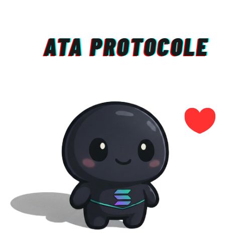

<div align="center">




### [**✨ Launch the ATA Hub →**](https://your-app-url.com)

<br>

[](https://discord.gg/YourDiscordInvite)
[](https://twitter.com/YourTwitterHandle)
[](LICENSE)

</div>

<br>

## **What is ATA Hub**

ATA Hub is an open-source solution for the Solana ecosystem. Its primary function is to identify and close empty Associated Token Accounts (ATAs) to **recover the SOL locked for storage rent**. In just a few clicks, you can clean up your wallet and optimize your asset management.

Our commitment: **100% open-source, 100% non-custodial, and 100% transparent.**

<br>

## **✨ Core Features**

🧹 **Smart Scan & Cleanup** - Automatically detects and closes unused token accounts for efficient SOL recovery.  
🔐 **Non-Custodial Security** - You maintain full control over your private keys and funds at all times. The protocol never has access to them.  
🎁 **Community NFTs** - Exclusive rewards are planned for early adopters and active project contributors.  
💬 **Private Discord Access** - Join a members-only channel to connect with the team and community.  

<br>

## **🗺️ Roadmap**

**✅ Phase 1** - Launch of the ATA Hub platform and community building.  
**🚧 Phase 2** - Introduction of the $ATA governance token and staking mechanisms.  
**📋 Phase 3** - Ecosystem expansion with new tools and implementation of a Decentralized Autonomous Organization (DAO).  

<br>

## **🛠️ Tech Stack**

Next.js • React • TypeScript • Solana Web3.js • Supabase • Tailwind CSS

<br>

## **🚀 Quick Start (for Developers)**

```bash
# Clone the repository and install dependencies
git clone https://github.com/younes-bkb/ata-protocol.git
cd ata-protocol
npm install

# Set up environment variables
cp .env.example .env.local

# Run the development server
npm run dev
```

<br>

## **🤝 Contributing**

This project is fully open-source, and all contributions are welcome. Feel free to open an [issue](https://github.com/younes-bkb/ata-protocol/issues) to report a bug or submit a *Pull Request* to suggest an improvement.

**Transparency is our priority.** The entire codebase is publicly auditable to ensure trust and security.

<br>

---

<div align="center">

**Built by the community, for the community.**


</div>
